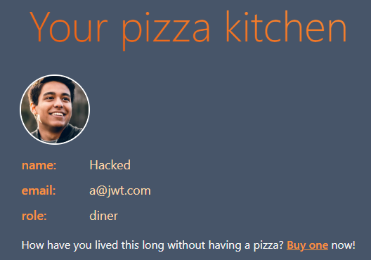
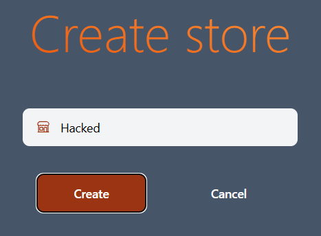
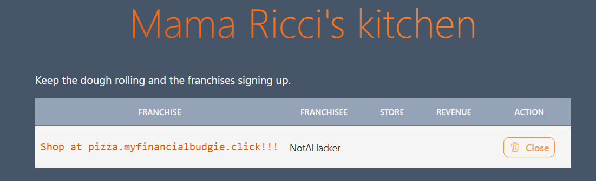
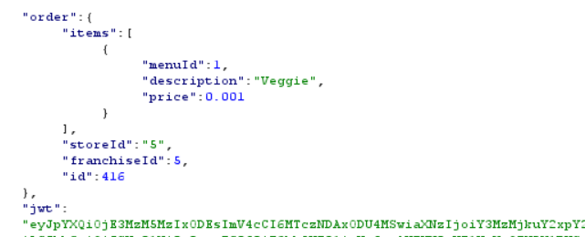
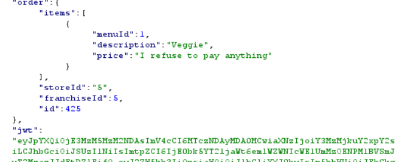
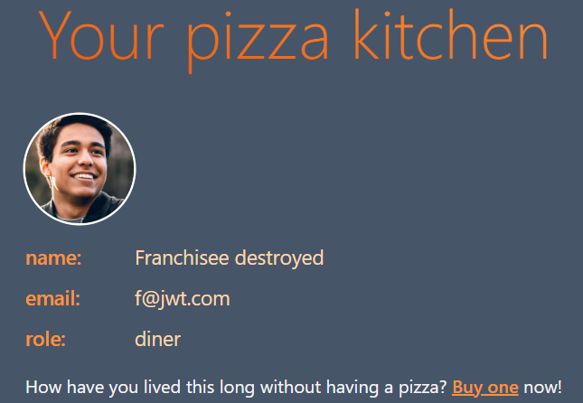

# Penetration testing: Hyrum Durfee and Eli Barton

# Self-attack
## Hyrum Durfee

**Date:** Dec 10, 2024

**Target:** pizza.myfinancialbudgie.click

**Classification:** Identification and Authentication Failures

**Severity**: High

**Description:** When a user attempts to create a new user, it does not check if that email was already in the database. If a previous user was in the database, all their data is thus overwritten. Accounts with elevated privileges are reset to diner status.

**Images:**

**Corrections:** Added a check for if the user already exists before creating them. If so, an error is returned.

## Eli Barton
### Attack 1
**Date:** Dec 10, 2024

**Target:** order.virtualpizza.click

**Classification:** Insecure Design

**Severity**: Critical

**Description:** Ordering system is vulnerable to people changing the price of the pizza in the POST request.

**Corrections:** Any users detected ordering a pizza with a negative price are immediately deleted from the database and their transaction is cancelled.

# Peer Attack
## Attack on order.virtualpizza.click

### Attack 1
**Date:** Dec 11, 2024

**Target:** order.virtualpizza.click

**Classification:** Security Misconfiguration

**Severity**: Critical

**Description:** The admin and franchisee accounts, a@jwt.com and f@jwt.com respectively, had the default passwords. All franchises and their stores were deleted and new ones with adversarial promotions were created.

**Images:**

**Corrections:** Change the default passwords, make them stronger, and store them in GitHub Secrets. Refactor the code (such as the tests) to use passwords from the config file generated by the CI Pipeline.

### Attack 2
**Date:** Dec 11, 2024

**Target:** order.virtualpizza.click

**Classification:** Insecure Design

**Severity**: High

**Description:** Pizza prices are specified in the HTTP request rather than the database. Prices specified below 0.001₿ result in the deletion of the user’s account. This sets the price of every pizza at 0.001₿ for everyone who knows how to send an HTTP request through curl. Additionally, the auth token of the deleted user was not cleared, so they were able to continue purchasing jwt pizzas (interestingly, while they got valid jwts these requests didn’t increment the store’s income). A similar attack is specifying a string for the price. This costs nothing and returns a valid jwt.

**Images:**

**Corrections:** Determine pizza price by the menu in the database, not by the parameters the user specifies in the HTTP request.

### Attack 3

**Date:** Dec 11, 2024

**Target:** order.virtualpizza.click

**Classification:** 

**Severity**: 

**Description:** Existing accounts can be overwritten by registering a new user with an email already assigned to an account. Demonstrated this by registering a new account with f@jwt.com as the email, which effectively removed the old franchisee account and replaced it with a diner account.

**Images:**

**Corrections:** Upon a registration HTTP request, check the database for an existing user, and return an error if the user already exists.

## Attack on pizza.myfinancialbudgie.click

### Attack 1
**Date:** Dec 11, 2024

**Target:** pizza.myfinancialbudgie.click

**Classification:** Insecure Design

**Severity**: Critical

**Description:** Ordering system is vulnerable to changing the price of the pizza in the POST request.

**Corrections:** Validate the prices in the request with the actual ones or remove it from the request.

### Attack 2
**Date:** Dec 11, 2024

**Target:** pizza.myfinancialbudgie.click

**Classification:** Insecure Design

**Severity**: Medium

**Description:** Requests to register can be sent repeatedly with the same information and they are processed by the system. This may result in increased loading times and operating costs. 

**Corrections:** Prevent repeated registrations or requests from the IP or containing the same information as a previous registration.

# Takeaways

- Open-sourced software can be useful, but it can also make it easier for a bad actor to scout out your system.

- An application with a good user interface that functions correctly can still be effectively broken if the developers are not security-minded.

- An application that hasn’t been pentested is an application vulnerable to exploitation.

- Don’t use any user input that you don’t expect them to change, such as the price for items.

- Beware of SQL injection and Cross-Site Scripting, although no vulnerabilities were found in this penetration test even though many attempts were made. They can be very dangerous.

- Create an easy and secure way to customize accounts and roles, otherwise it can be very difficult to recover a lost admin account.

- Track IP addresses in logs, otherwise the activity of bad actors is essentially incognito.
